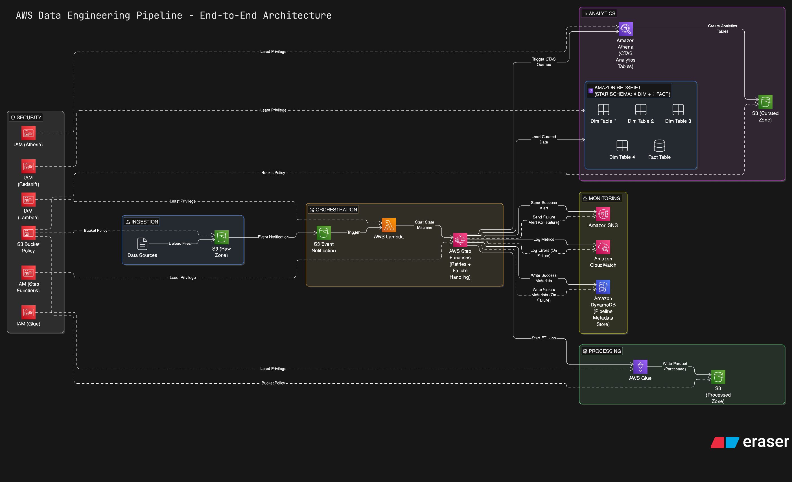

# AWS End-to-End Data Engineering Pipeline

## Overview
This project demonstrates a production-ready end-to-end Data Engineering pipeline built on AWS using a Lakehouse-style architecture.

The pipeline ingests raw data into Amazon S3, processes it using AWS Glue (PySpark), and serves analytics-ready data through Amazon Athena and Amazon Redshift.

It follows a layered architecture:
- Raw → Processed → Curated

---

## Architecture

**Flow:**
1. Raw data lands in S3  
2. Glue ETL cleans & transforms data  
3. Data is partitioned by year/month  
4. Curated data is queried using Athena  
5. Analytics tables are loaded into Redshift  

---

## Tech Stack

- Amazon S3 (Data Lake)
- AWS Glue (PySpark ETL)
- Amazon Athena
- Amazon Redshift
- AWS Step Functions (Orchestration)
- AWS IAM (Security)

---

## Pipeline Design

### Raw Layer
- Stores source CSV/JSON files
- Schema-on-read
- No transformations

### Processed Layer
- Data cleaning & standardization
- Null handling, trimming, casting
- Partitioned by year/month

### Curated Layer
- Analytics-ready fact & dimension tables
- Star schema design
- Optimized for BI queries

---

## Key Features

- Incremental partition processing  
- Data quality validation  
- Fault-tolerant Glue jobs  
- Cost-optimized Parquet storage  
- Production debugging (corrupted partitions, argument handling)

---

## How to Run

1. Upload sample data to S3 raw bucket  
2. Run Glue job: `raw_to_processed.py`  
3. Run Glue job: `processed_to_curated.py`  
4. Query using Athena  
5. Load into Redshift  

---

## Key Learnings

- Data Lake & Data Warehouse system design  
- AWS Glue ETL best practices  
- Partition strategy and optimization  
- Production failure debugging  
- End-to-end pipeline orchestration  